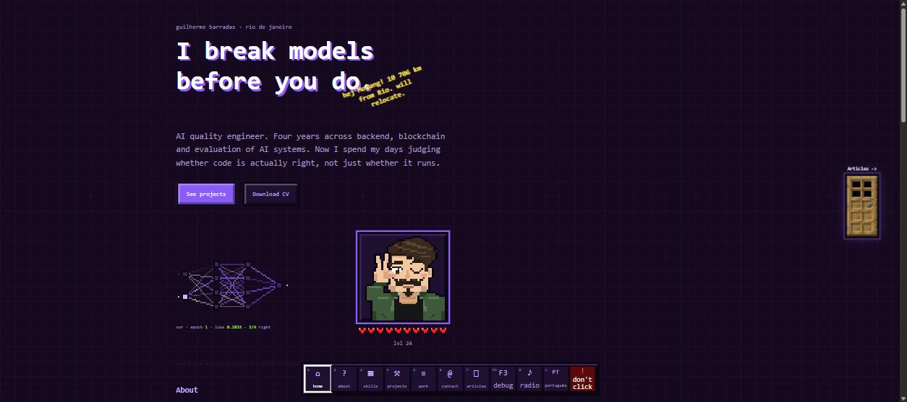
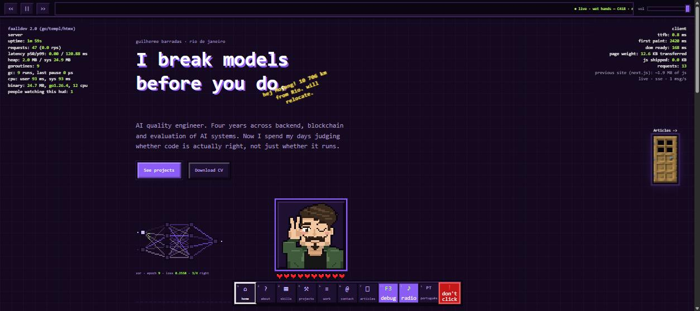
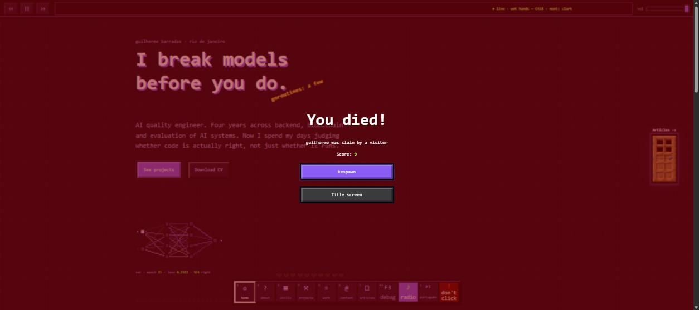
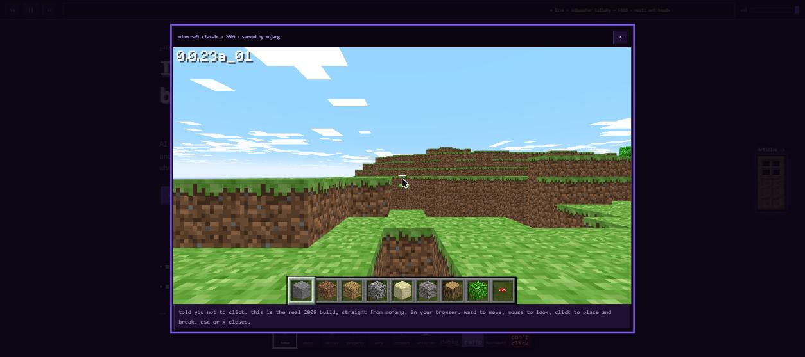
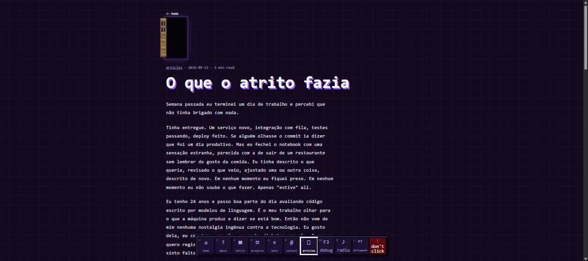
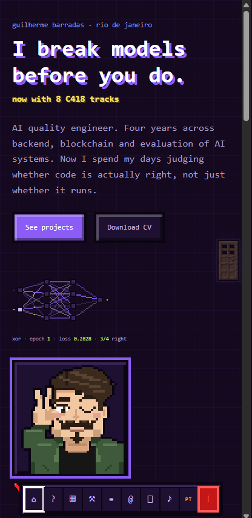

# faalldev

Personal site of Guilherme Barradas, live at **[faalldev.fly.dev](https://faalldev.fly.dev/)**.

One Go binary. Server-rendered with templ. About 30 KB of hand-written JavaScript, no framework
on the client. Everything that looks like a number is a real number: press F3.

<p align="center">
  
</p>

| F3 debug HUD + radio | You died! | Easter egg |
|---|---|---|
|  |  |  |

| Articles | Phone |
|---|---|
|  |  |

## What is in it

- **F3 HUD.** Uptime, requests, p50/p99 latency, heap, goroutines, GC pauses, CPU time, binary size and
  how many people have the HUD open, streamed once a second over Server-Sent Events. The client column
  comes from the browser's Performance API. Nothing is mocked.
- **Radio.** A Habbo-style station: eight C418 tracks scheduled by the wall clock, so every listener hears
  the same second of the same song. The bar on top has transport, a scrolling title and volume, and the
  station survives navigation between pages.
- **The avatar takes damage.** Hover shows a hand-drawn sword cursor. Hits play the game's own sounds,
  flash the hearts, knock him back and cost HP; hearts regenerate with the game's hop; at zero he falls
  over, turns into smoke and the red "You died!" screen shows. Respawn unlocks a red hotbar slot that
  says *don't click*.
- **Don't click.** It opens the official Minecraft Classic (2009) that Mojang serves at
  classic.minecraft.net, in a modal, playable.
- **A real neural network.** The pixel network in the hero is a 2-4-4-1 MLP training on XOR with SGD, one
  epoch per animation frame. Edges are the live weights, pulses are the live activations, the output
  node goes red when it is wrong, the caption is the live loss. Click to reinitialise.
- **The oak door** (real game texture) opens into the articles: the leaf swings on its hinge, the doorway
  swallows the screen, and Chrome continues the doorway into the next page with a cross-document view
  transition. Under 1200 px it is a translucent ghost that turns solid on tap.
- **Articles** are markdown in the repo, rendered once at startup, with a badge back to where they were
  published so people read here and engage there.
- **Splash text** by the title, like the game's, 30 short true lines, one every ten seconds.
- **Two languages**, English and pt-BR, rendered server-side. Cookie wins, then `Accept-Language`.
- **Hotbar** navigation with the game's key hints: 1 to 7 for sections, F3, R for radio, L for language.

## Architecture

```mermaid
flowchart LR
  subgraph browser
    hud[hud.js<br/>F3 overlay]
    radio[radio.js<br/>one audio element]
    sfx[sfx.js<br/>sounds, HP, death]
    net[net.js<br/>MLP on a canvas]
    door[door.js]
    egg[egg.js]
  end
  subgraph binary["one Go binary (24 MB, scratch image)"]
    mux[net/http mux<br/>Go 1.22 patterns]
    views[templ views<br/>i18n table]
    metrics[metrics<br/>ring buffer + rusage]
    station[radio<br/>schedule = f(clock)]
    articles[articles<br/>markdown → html at boot]
    static[embed.FS<br/>css, js, img, sfx, ogg, md]
  end
  browser -- "GET / , /articles/{slug}" --> mux --> views
  hud -- "SSE /metrics/stream" --> metrics
  radio -- "/radio/now, /radio/playlist" --> station
  mux --> articles
  mux -- "/static/*" --> static
  egg -- iframe --> mojang[(classic.minecraft.net)]
```

Every request goes through one middleware that counts it, measures its latency into a 1024-slot ring
buffer and adds its bytes; `/metrics/stream` is the only path excluded, so the HUD does not measure
itself. Static files get a year-long immutable cache header, but only on 200 and 206: a cached 404 once
outlived the file being added, so the cache writer looks at the status first.

```mermaid
sequenceDiagram
  participant B as browser
  participant S as server
  B->>S: click ♪ → GET /radio/now
  S-->>B: {index, url, offset_s, next}  (pos = (now − epoch) mod total)
  B->>B: audio.src = url; seek offset_s + round trip; play()
  Note over B: same audio element for the whole session,<br/>unlocked by play() inside the tap (iOS)
  B->>S: track ended → GET /radio/now
  S-->>B: next track, offset ≈ 0
  Note over B,S: navigation: state in localStorage,<br/>next page re-asks the clock
```

The schedule is a pure function of time since a fixed epoch, so it needs no state, survives restarts and
is identical across replicas. Track durations come from the Ogg headers at startup, so the playlist is
just title, artist and file.

### Repository

```
cmd/server        entrypoint, routes, graceful shutdown, cache middleware
cmd/avatargen     draws static/img/avatar.png and favicon.png pixel by pixel (make avatar)
internal/metrics  request counting, latency percentiles, CPU time per OS, SSE stream
internal/radio    wall-clock station, Ogg duration parser, /radio/now and /radio/playlist
internal/articles markdown subset → html, front matter, word count
internal/handlers templ → http, language from cookie or Accept-Language
views/*.templ     layout, hotbar, HUD, radio bar, egg modal, home, articles
views/i18n.go     every UI string as an {en, pt-BR} pair
content/articles  the writing, one .md each
static/js         one small file per feature, no bundler
static/css        one stylesheet, pixel chrome from CSS variables, all breakpoints at the end
scripts/mc_sfx.py copies sounds, music and block textures out of a local Minecraft install
```

## Decisions

**Go + templ, one binary.** The whole site, assets included, is a single static file in a `scratch`
image. No runtime, no node_modules, nothing to keep patched. `go:embed` ships CSS, JS, images, sounds,
the music and the markdown; the binary is 24 MB because 18 MB of it is C418.

**No client framework.** The previous version was Next.js and shipped about 1.9 MB of JavaScript. This
one ships about 30 KB across seven files, each owning one feature, loaded with `defer`. htmx is in the
stack line because the pages are server-rendered HTML that the browser fetches whole; there is no
client-side routing to speak of.

**A page-size gate in the tests.** `TestHomeSize` fails the build if the home HTML passes 40 KB. It is
the site's own quality bar: features are welcome, weight is not.

**Metrics that cannot lie.** The HUD shows what the process reports about itself. Percentiles come
from a ring buffer of the last 1024 latencies; CPU time comes from `getrusage` on Unix and
`GetProcessTimes` on Windows, split by build tag so the site builds on the machine it is written on.
SSE streams are capped at 64 concurrent and 10 minutes each, so the HUD cannot be used to hold sockets.

**Radio by the clock, not by state.** See the sequence above. The alternative, a server that tracks
"now playing", would need state, locks and a story for restarts. Modulo arithmetic on the wall clock
needs none of that, and it is what makes "everyone hears the same thing" literally true.

**One `<audio>` element for the whole session.** Phones only let an element play later (next track,
after a fetch, on the next page) if it already played once inside a user gesture. The radio unlocks
its single element with a 44-byte silent WAV on the tap that turns it on, then only ever changes `src`.
The avatar hit is on `click`, not `pointerdown`, because a touch `pointerdown` is not a gesture for
audio.

**Real assets, not in the repo.** The sounds, the music and the door texture are Mojang's. They come
from the visitor's own Minecraft install via `scripts/mc_sfx.py`, which reads the launcher's asset
index and the client jar, and they are git-ignored here. The easter egg embeds the official
classic.minecraft.net rather than any clone.

**Server-side language.** Two columns in one Go map, a cookie set by `/lang/{code}`, `Accept-Language`
as the fallback. No JavaScript i18n, no flash of the wrong language. Article bodies keep the language
they were written in. The F3 HUD and the splash lines stay English on purpose: the game does not
translate its splashes either (checked against `pt_br.json` in the jar; none of the 454 lines is in it).

**Articles as embedded markdown.** LinkedIn has no feed, so the writing lives in `content/articles/*.md`
with a small front matter, rendered once at boot by a 100-line renderer that handles exactly the subset
the pieces use. The page carries `lang`, so the browser's translator works, and a badge points back to
the original post for likes and comments.

**The avatar is a program.** `cmd/avatargen` draws the 48×48 portrait as rectangles and single pixels,
outlines the silhouette, crops the favicon from the face before the hand is drawn, and writes both PNGs.
Changing the moustache is editing a line.

**Neural network in the browser.** A 2-4-4-1 MLP with tanh hidden layers, sigmoid output and plain SGD,
about 60 lines. It is decoration that happens to be true: the loss in the caption is the loss.

**One structure on every screen.** Text on top, then the pixel row (network, avatar), left-aligned.
The gap in the row is `clamp(32px, 7.5vw, 144px)`. Under 500 px the row stacks; under 480 px the hotbar
drops F3 and the key hints so ten slots fit in 360 px; under 1200 px the door becomes a ghost.
Verified at 320/360/414/768/1024/1366/1920.

**Lean on purpose.** A repo-wide over-engineering audit removed 317 lines before the first commit: a
chiptune generator the radio no longer needed, synthesized sound fallbacks, a WAV parser, remote-URL
support nobody used. Zero dependencies beyond templ.

## Run

```
go install github.com/a-h/templ/cmd/templ@v0.2.747
make run          # http://localhost:8080
make dev          # hot reload with air (go install github.com/air-verse/air@latest)
make test         # vet + tests, including the page-size gate
make avatar       # regenerate avatar.png and favicon.png from cmd/avatargen
```

The Go and Windows toolchain notes: the templ CLI must match the version in `go.mod`; a newer CLI
generates code that does not compile against it.

### Assets from your own Minecraft install

```
python scripts/mc_sfx.py                   # ui click, hurt, death oof, fall thud, door sounds
python scripts/mc_sfx.py --textures        # oak door top/bottom
python scripts/mc_sfx.py --music           # every track in static/radio/playlist.json
python scripts/mc_sfx.py --list            # the 70 music tracks in the index
```

Without them the site runs silent, the radio logs "0 tracks" and the door has no texture. Nothing else
breaks.

### Deploy

`fly.toml` describes one always-on shared-cpu machine in São Paulo. `flyctl launch --no-deploy` once,
then `flyctl deploy`; Fly builds the Dockerfile remotely. Deploys are run from a machine that has the
Mojang assets; there is no deploy-on-push workflow, on purpose, because the repository does not contain them.

## Tests

```
internal/handlers   page-size gate, both languages, cookie vs Accept-Language, /lang redirect safety,
                    articles list and page, 404 on unknown slug
internal/radio      schedule is a function of time (loops, negative time, a day later), silent station,
                    playlist loading, Ogg duration from a synthetic file
internal/articles   front matter, markdown subset, escaping
```

## Credits

Minecraft, its sounds, music (C418) and textures belong to Mojang Studios and are not distributed in
this repository. Minecraft Classic is served by Mojang at classic.minecraft.net. The pixel avatar is
drawn from an illustration of the author. Everything else © Guilherme Barradas.
